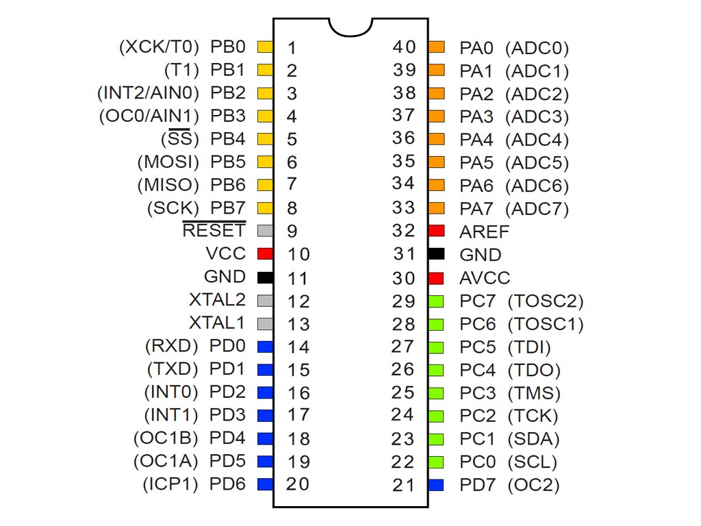

# ATmega32 Drivers
My ATmega32 drivers journey. Integrate microcontroller peripherals smoothly. Simplify development with clear documentation and modular code for smooth hardware interaction.

  

## Layered Architecture

The driver is structured into the following layers:

### [MCAL (Microcontroller Abstraction Layer)](MCAL/)

- **[ADC](MCAL/ADC/):** A/D Converter Module
- **[DIO](MCAL/DIO/):** Digital Input/Output module
- **[EXTI](MCAL/EXTI/):** External Interrupt module
- **[PWM](MCAL/PWM/):** Pulse Width Modulation Module
- **[TIMER0](MCAL/TIMER0/):** TIMER/Counter 0 Module
- **[TIMER1](MCAL/TIMER1/):** TIMER/Counter 1 and ICU Module
- **[TIMER2](MCAL/TIMER1/):** TIMER/Counter 2 Module
- **[WATCHDOG](MCAL/WATCHDOG/):** WatchDog Timer Module
- **[USART](MCAL/USART/):** USART Communication Protocol Module
- **[SPI](MCAL/SPI/):** SPI Communication Protocol Module
  
### [HAL (Hardware Abstraction Layer)](HAL/)

- **[LCD](HAL/LCD/):** Character LCD display control module.
- **[KEYPAD](HAL/KEYPAD/):** Keypad control module.
- **[SEVEN_SEGMENTS](HAL/SEVEN_SEGMENTS/):** Seven-segment display control module.
- **[IR SENSOR](HAL/IR_SENSOR/):** Infrared Sensor module.
- **[STEPPER MOTOR](HAL/STEPPER_MOTOR/):** Stepper Motor control module.

### Application Layer

- [main.c](main.c): Main application code file.
- [STD_TYPES.h](STD_TYPES.h): Header file for standard data types.
- [BIT_MATH.h](BIT_MATH.h): Header file for bitwise manipulation functions.

## Contributing
Please feel free to open issues or pull requests to help improve and expand the drivers.
